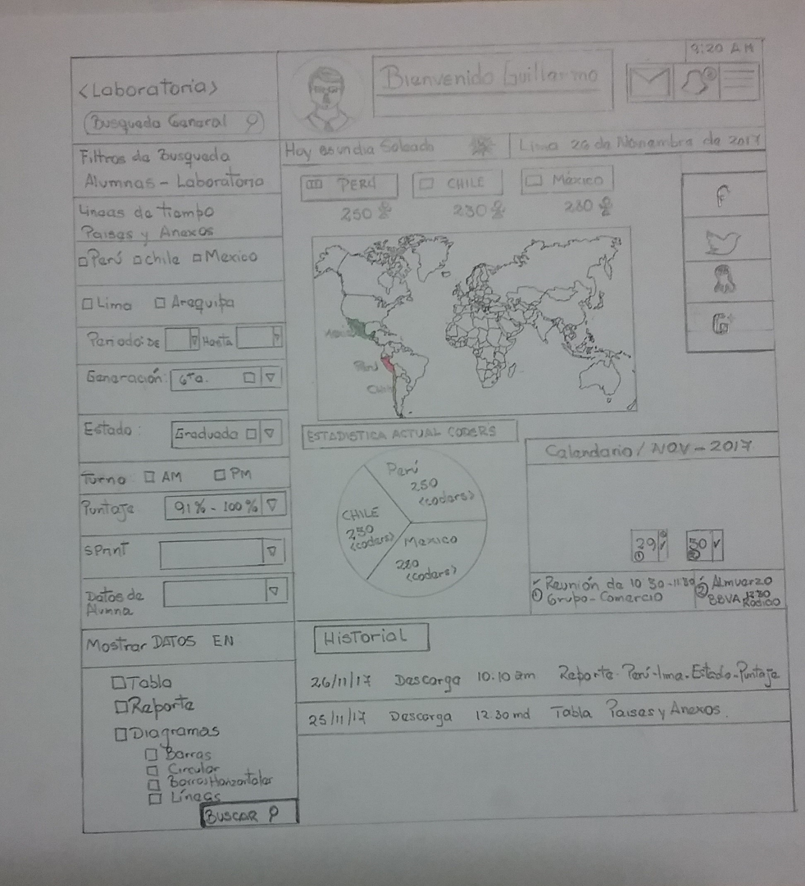
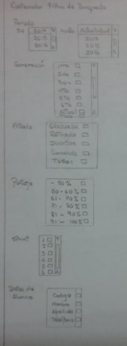
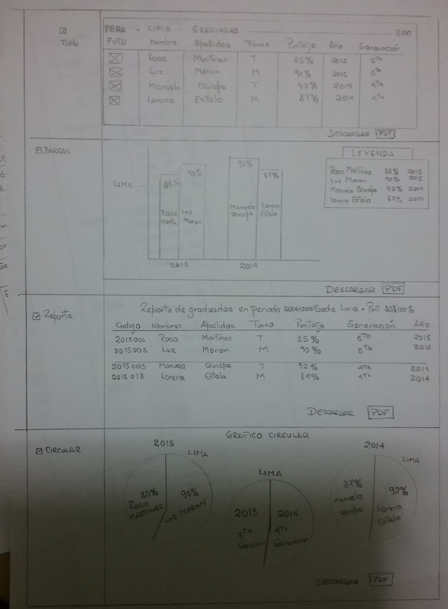

# Sketch del dashboard de Laboratoria.

## Sketch Principal para representar el prototipo de Dashboard de Laboratoria

### Pagina scketch principal.
	1. La pagina principal contiene, un menu de usuario, donde informa mensajes, favoritos y màs.
	2. La seccion izquierda indica una busqueda general donde puede digitarse algun dato conocido y lineas siguientes muestra el listado general de busquedas, que incluye:
		. Sede.
		. Periodo.
		. Generaciòn.
		. Estado.
		. Turno.
		. Puntaje.
		. Sprint.
		. Datos
		. Mostrar Datos
			. Tabla.
			. Reporte.
			. Diagramas.
				. Barras.
				. Circular.
				. Barras Horizontales.
				. Lineas.
		.Boton buscar.
	3. La secciòn central contiene:
		. Estadistica general por cada sede.
		. Muestra calendario, y activa alarmas de reuniones actuales
		. Muestra historial de descargas.
	4. En la seccion izquierda:
		. Muestra datos de redes sociales.
		. Actualidad.

## Descripcion detallada de filtros de busqueda.

### Filtros detallados (secciòn izquierda de 1era pagina de prototipo).
	1. Los filtros detallados contienen:
		. Periodo:	2014 hasta la actualidad:
		. Generaciòn : 1era hasta la actual.
		. Estado : Graduada, Retirada, Inscritas, Cursando o todas.
		. Puntaje: -50% hasta 100%.
		. Sprint :  1 hasta actual.
		. Datos de alumna: Codigo, Nombre, Apellido, telefono.

## Pagina scketch representaciòn de filtros de busqueda, en este caso es de alumnas gradudas con promedio de 85 a 100%, de la sede de Lima.

### Lista de Filtros de busqueda que incluye el prototipo presentado.
	1. Los requeridos
		. # de alumnas inscritas
		. # de alumnas que desertaron
		. # y % de alumnas que pasan el criterio mínimo de evaluación
		. Promedio de notas por sprint
		. Promedio de notas HSE
		. Promedio de notas técnicas
	2. Filtros adicionales:
		. Filtro general de por año.
		. Filtro general por sede y anexos.
		. Comparativos y promedios.
		. Mas.

### Creaciòn de Repositorio y Pag.Web.
